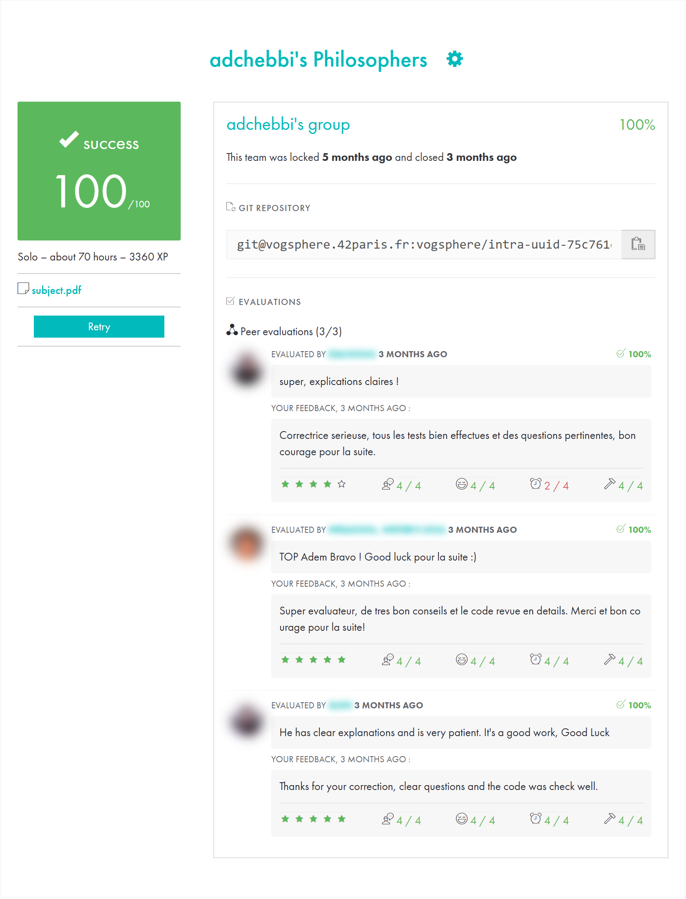

*This project has been created as part of the 42 curriculum by adchebbi.*

# Philosophers

> The dining philosophers problem in C with POSIX threads: one thread per philosopher, one mutex per fork,
> a monitor that detects starvation in under 10 ms. No deadlocks, no data races, no leaks.

   

```console
$ ./philo 5 800 200 200 7
0 1 has taken a fork
0 1 has taken a fork
0 1 is eating
0 3 has taken a fork
...
```

## Highlights

- **Deadlock-free by design**: fork-locking order depends on parity, so the circular wait can never form.
- **Race-free**: every shared value (forks, stop flag, last meal time, meal count, output) is behind a mutex.
  Checked with Valgrind's **Helgrind** (0 errors).
- **Timing precision**: a dedicated monitor checks every philosopher every 0.5 ms, and a custom `precise_sleep`
  replaces imprecise long `usleep` calls.
- **Robust**: input validation, single-philosopher edge case, clean shutdown even if `pthread_create` fails.
  **Memcheck** reports 0 leaks.

## The problem

N philosophers sit around a table, with one fork between each pair of neighbors. To eat, a philosopher needs
both adjacent forks. Each one loops eat → sleep → think, and dies if they do not start eating within
`time_to_die` ms of their last meal. The program must keep everyone alive when the timings allow it, and
report a death within 10 ms when it happens.

## Build & Run

```bash
cd philo
make
./philo number_of_philosophers time_to_die time_to_eat time_to_sleep [number_of_times_each_philosopher_must_eat]
```

| Argument | Meaning |
|---|---|
| `number_of_philosophers` | 1 to 200 (also the number of forks) |
| `time_to_die` (ms) | Max delay between the start of two meals (or since the start of the simulation) |
| `time_to_eat` (ms) | Time spent eating, holding both forks |
| `time_to_sleep` (ms) | Time spent sleeping |
| `must_eat` (optional) | Stop once every philosopher has eaten this many times |

Output format: `timestamp_ms philosopher_id action`. Messages never overlap.

## Test results

| Command | Expected | Result |
|---|---|---|
| `./philo 1 800 200 200` | dies (only one fork) | `801 1 died` ✅ |
| `./philo 4 410 200 200` | nobody dies | no death over the run ✅ |
| `./philo 5 800 200 200` | nobody dies | no death over the run ✅ |
| `./philo 4 310 200 100` | one death | `311 1 died` ✅ |
| `./philo 5 800 200 200 7` | stops after 7 meals each | clean stop, no death ✅ |
| `./philo 200 800 200 200` | nobody dies | no death over the run ✅ |
| `./philo 201 …`, `./philo 5 800 abc 200` | error | rejected with message, exit 1 ✅ |
| `valgrind --tool=helgrind` | no data race | 0 errors ✅ |
| `valgrind --leak-check=full` | no leak | 0 leaks ✅ |

## How it works

- **One thread per philosopher, one mutex per fork.** Taking a fork means locking its mutex.
- **Breaking the circular wait.** If everyone grabbed their left fork at once, they would all wait forever for
  the right one. Instead, **even** philosophers take their **right** fork first and **odd** philosophers their
  **left** fork first. Two neighbors compete for the same first fork, so the loser holds nothing.
- **Independent monitor.** The main thread scans all philosophers every 0.5 ms, comparing `now - last_meal` to
  `time_to_die`, and also counts meals when `must_eat` is set.
- **Protected state.** Separate mutexes for the forks, printing, the stop flag, and each philosopher's meal data,
  which the philosopher writes and the monitor reads.
- **Precise sleep.** `precise_sleep` sleeps in short steps while checking the clock and the stop flag, so a
  philosopher reacts quickly when the simulation ends.
- **Single philosopher.** Both "forks" would be the same mutex, so this case is handled separately.
- **Safe shutdown.** `launched_count` tracks how many threads were really created, so a failed
  `pthread_create` only joins existing threads before destroying mutexes and freeing memory.

## Project structure

```
philo/
├── Makefile      # cc -Wall -Wextra -Werror -pthread
├── philo.h       # t_philo / t_table structures and prototypes
├── main.c        # init, launch threads, run monitor, cleanup
├── parse.c       # argument validation
├── init.c        # allocation, mutex init, thread creation
├── routine.c     # a philosopher's life: eat / sleep / think
├── forks.c       # deadlock-free fork locking order
├── monitor.c     # death detection and meal counting
├── state.c       # protected read/write of the stop flag
├── log.c         # protected printing
├── time.c        # millisecond clock and precise sleep
└── cleanup.c     # join threads, destroy mutexes, free memory
```

## Resources

- E. W. Dijkstra, *Hierarchical ordering of sequential processes* (origin of the problem)
- [Dining philosophers problem](https://en.wikipedia.org/wiki/Dining_philosophers_problem) on Wikipedia
- [POSIX Threads Programming](https://hpc-tutorials.llnl.gov/posix/), LLNL tutorial
- Man pages: `pthread_create`, `pthread_join`, `pthread_mutex_init`, `pthread_mutex_lock`, `gettimeofday`, `usleep`

### AI usage

An AI assistant (Claude) was used as a **learning and pair-programming tool** to:

- **understand the concepts**: threads, mutexes, data races, deadlocks, and the problem itself;
- **design the architecture**: thread-per-philosopher, mutex-per-fork, separate monitor;
- **reason about correctness**: deadlock-free locking order, protected meal data, single-philosopher case;
- **write and review the C code**, and **interpret** `valgrind` and `helgrind` reports.

Every function and design decision was explained, reviewed and understood before being kept, so the project
can be defended line by line.

## 42 evaluation

Validated at **100/100** by 3 peer evaluations.
Other students' names and photos are blurred.

<p align="center"></p>

## Author

**Adem Chebbi** ([@ademchbb](https://github.com/ademchbb)), 42 login `adchebbi`
